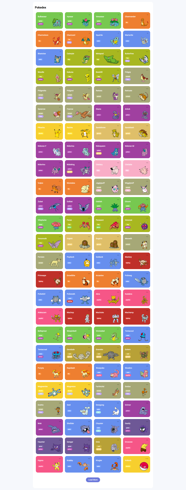
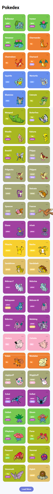
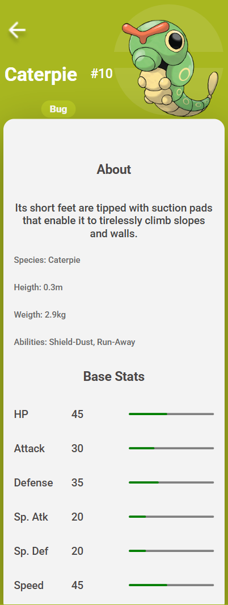

# Desafio Pokédex - Formação JavaScript Developer 🚀

## 📌 Sobre o Projeto  

Seja bem-vindo(a) ao primeiro desafio da **Formação JavaScript Developer** da **DIO**! Neste projeto, desenvolvi uma **Pokédex interativa** utilizando **HTML, CSS e JavaScript**.  Para isso, consumi uma **API REST** de Pokémon, permitindo visualizar e explorar diversos dados, como nome, número, tipo(s), base stats e muito mais!  

## 🎯 Aprendizados  

Este projeto foi uma excelente oportunidade para fortalecer meus conhecimentos em:  

- **JavaScript**, aprimorando a manipulação do DOM.  
- **Consumo de API REST**, entendendo como estruturar e exibir dados dinâmicos.  

## 🖥️ Tecnologias Utilizadas  

- **HTML5** para estruturação do conteúdo.  
- **CSS3** com **Flexbox** e **Media Queries** para responsividade.  
- **JavaScript** para consumo da **Pokémon API**.  
- **Pokémon API** para fornecer as informações dos Pokémons.  

## 📦 Temas Abordados  

Este projeto abordou os seguintes tópicos:  

✔️ Consumo de API REST  
✔️ Manipulação do DOM com JavaScript   

## 🌈 Demonstração  
Você pode conferir o resultado final do projeto clicando **[aqui]()**.  

---

### 📸 **Imagens do Projeto**

##### 💻 **Desktop**  
  

##### 📱 **Mobile**  

  

## 💡 Inspiração  

O design da Pokédex foi inspirado no trabalho do designer **Saepul Nahwan**, com foco em uma interface limpa e moderna.

📌 Confira o design original no **[Dribbble](https://dribbble.com/shots/6540871-Pokedex-App)**.  